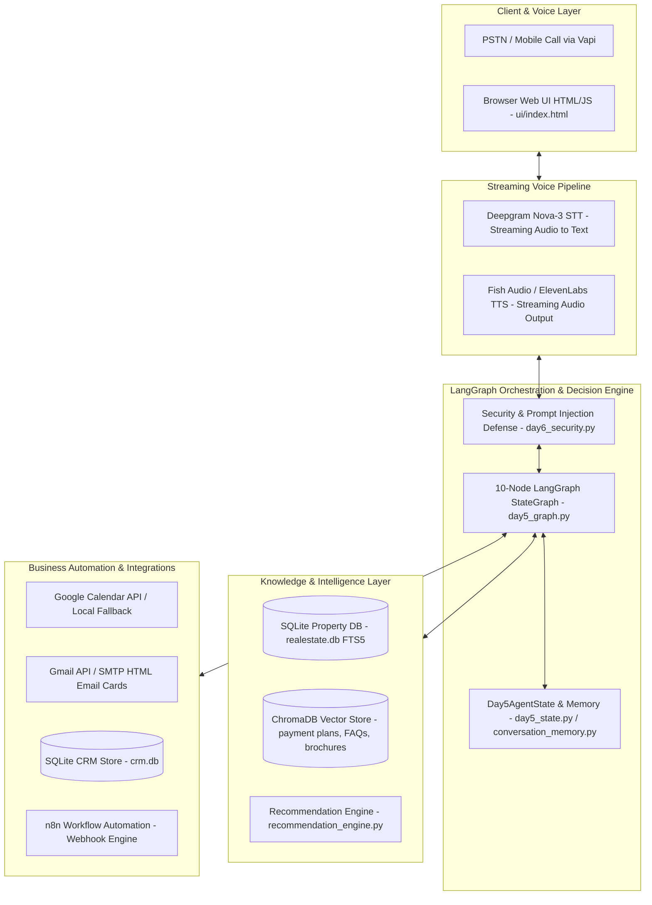

# RealEstate Hub — Voice & Chat Conversational AI Agent

> **Production-Grade Conversational & Voice AI Agent for the Pakistani Real Estate Market**  
> Built with FastAPI, LangGraph Orchestration, Hybrid SQL + Vector RAG Retrieval, Streaming Speech-to-Text & Text-to-Speech, Google Calendar Integration, Automated HTML Email Cards, CRM Tracking, Security Guardrails, and Comprehensive 42-Case Evaluation Suite.

---

## 📌 Executive Summary

**RealEstate Hub** is an end-to-end autonomous Voice and Chat AI Agent engineered specifically for Pakistan's real estate ecosystem. Unlike standard text-based chatbots, RealEstate Hub operates as an empathetic, high-speed sales executive capable of low-latency UrduLish conversation, natural barge-in interruption handling, slot extraction, property recommendation based on real verified listings, appointment scheduling, and automated CRM logging.

The system is constructed across **Week 7 (Day 1 to Day 6)**, progressing from architectural foundational design to data storage, RAG pipelines, streaming voice protocols, business workflow automations, LangGraph state machine orchestration, and production security/evaluation suites.

---

## 🏗 System Architecture & Technology Stack



### Technology Breakdown by Layer

| Component Layer | Technology / Tools Used | Primary Function |
| :--- | :--- | :--- |
| **Frontend Web Interface** | HTML5, Vanilla CSS3 (Dark Mode / Glassmorphism), WebSockets, JavaScript (ES6+), Vapi Web SDK | Interactive browser client, live microphone audio streaming, waveform UI, transcript visualization, latency monitoring. |
| **Backend Web Servers** | Python 3.11, FastAPI, Uvicorn, Flask, Flask-SocketIO, Asyncio | Async REST API endpoints, real-time audio WebSocket bridges (`/ws/voice/{session_id}`), Vapi webhook tools (`/api/vapi/property-search`). |
| **Speech-to-Text (STT)** | Deepgram Nova-3, Vapi Transcriber | Real-time streaming PCM audio transcription with Urdu-English code-switching and Voice Activity Detection (VAD). |
| **Text-to-Speech (TTS)** | Fish Audio (WebSocket stream), ElevenLabs API, Vapi Voice | Expressive UrduLish voice synthesis with low latency, emotion control, and barge-in interruption cancellation. |
| **LLM Reasoning & NLU** | Groq API (`openai/gpt-oss-20b` & `openai/gpt-oss-120b`), HuggingFace | Slot extraction, intent detection, UrduLish conversational generation, grounded RAG synthesis. |
| **Orchestration Engine** | LangGraph (`StateGraph`), LangChain Core | 10-Node state machine routing, conditional branching, explicit tool calling, transition tracing (`day5_traces.db`). |
| **Structured Data Storage** | SQLite (`realestate.db`), FTS5 Full-Text Search | 191,393 verified property listings, commercial inventory, exact price/bedroom/city filtering. |
| **Semantic Vector Store** | ChromaDB, `sentence-transformers/all-MiniLM-L6-v2` | Dense vector indexing for developer notes, FAQs, payment plans, and brochures. |
| **Calendar Scheduling** | Google Calendar API (v3), Python `google-auth`, SQLite Fallback | RFC3339 datetime parsing, `Asia/Karachi` timezone management, slot availability checking, double-booking prevention. |
| **Email Automation** | Gmail API (OAuth2 / Service Account), Python `smtplib`, MIME | Color-coded responsive HTML email card dispatch to assigned sales representatives. |
| **CRM & Workflow System** | SQLite (`crm.db`), n8n Workflow Automation Engine | Persistent client profile storage, preference tracking, automated follow-up reminders, end-of-call webhooks. |
| **Security & Evaluation** | Custom Guardrails (`day6_security.py`), Pytest, Docker, GitHub Actions | Prompt injection defense, 42-case evaluation harness (`day6_evaluator.py`), performance monitoring DB (`day6_monitoring.db`). |

---

## 📂 Comprehensive Project Directory & File Guide

Below is the file structure map of the entire project repository:

```text
capstone/
├── ui/
│   └── index.html                          # Interactive Web GUI (Voice & Text Chat Client)
├── day1/
│   ├── README.md                           # Day 1 Architectural & Persona Specifications
│   ├── voice_agent_architecture.png        # Pipeline Architecture Diagram
│   └── flowchart/                          # Conversation Flowchart Visual Assets
├── knowledge_docs/                         # Source documents for RAG indexing
│   ├── brochure_gulberg.txt
│   ├── developer_notes.txt
│   ├── faq_booking.txt
│   ├── payment_plan_bahria.txt
│   └── payment_plan_dha.txt
├── .github/workflows/
│   └── ci.yml                              # GitHub Actions CI/CD Pipeline
├── app.py                                  # Flask + SocketIO Deepgram Flux Web Application
├── app_day3.py                             # FastAPI Voice & Chat Application (Day 3 Endpoints)
├── app_day5.py                             # FastAPI Server for LangGraph Orchestration (Day 5)
├── app_day6.py                             # Production FastAPI Server (Day 6 Security & Evaluation)
├── appointment_agent.py                    # Multi-turn Conversational Appointment Flow Agent
├── appointment_store.py                    # SQLite Storage Engine for Appointment Records
├── appointments.db                         # SQLite Database for Active Appointments
├── calendar_service.py                     # Dual Google Calendar API & Local Calendar Provider
├── chroma_db/                              # Persistent ChromaDB Vector Index Directory
├── conversation_memory.py                  # Short-term / Long-term Session Memory Store
├── crm_agent.py                            # CRM Conversational Command & Logging Handler
├── crm_config.py                           # CRM Configuration & Follow-up Delay Rules
├── crm_store.py                            # SQLite Client History & Reminder Storage Engine
├── crm.db                                  # SQLite Database for Client Profiles & Reminders
├── crm-call-automation-workflow.json       # n8n Production Call Automation Workflow
├── crm-call-automation-error-handler.json  # n8n Error Handling & Failure Notification Workflow
├── day1/README.md                          # Day 1 Deep-Dive Specification Report
├── day2-README.MD                          # Day 2 Dataset & RAG Evaluation Report
├── day3-README.md                          # Day 3 Voice & Streaming Protocol Report
├── day3_agent.py                           # Day 3 Conversation Engine & Slot Router
├── day3_config.py                          # Day 3 Configuration (API keys, models)
├── day3_memory.db                          # SQLite Database for Multi-Turn Conversation Memory
├── day3_objections.py                      # 6-Category UrduLish Objection Classifier & Strategy
├── day3_orchestrator.py                    # Main Day 3 Conversational Orchestrator
├── day3_router.py                          # Intent & Retrieval Route Classifier (SQL / RAG / Chat)
├── day4-README.md                          # Day 4 Workflows & Integrations Report
├── day4-task4-n8n-README.md                # Day 4 n8n Integration Guide
├── day4_config.py                          # Day 4 Business Hours, Calendar & Email Config
├── day5-README.md                          # Day 5 LangGraph Orchestration Report
├── day5_agent.py                           # Day 5 Agent Wrapper Function
├── day5_config.py                          # Day 5 Configuration & Graph Settings
├── day5_graph.py                           # 10-Node LangGraph StateGraph Definition
├── day5_state.py                           # Day5AgentState TypedDict Schema Definition
├── day5_tools.py                           # 6 Wrapped Autonomous Python Tools
├── day5_traces.db                          # SQLite Database for Execution Trace Logging
├── day6-README.md                          # Day 6 Security & Evaluation Report
├── day6_config.py                          # Day 6 Evaluation & Security Threshold Settings
├── day6_eval_report.json                   # Output Metrics Report of 42-Case Evaluation Run
├── day6_evaluator.py                       # 42-Case Automated Benchmark Suite
├── day6_monitoring.py                      # Real-time Metrics Tracker & SQLite Storage
├── day6_monitoring.db                      # SQLite Database for Audit & Latency Metrics
├── day6_security.py                        # Prompt Injection & Adversarial Defense Guardrails
├── Dockerfile                              # Production Docker Container Specification
├── docker-compose.yml                      # Multi-container Compose File
├── dummy_commercial_properties.csv         # 150-Row Synthetic Commercial Property Dataset
├── email_service.py                        # Gmail API / SMTP / Console HTML Email Dispatcher
├── employees.json                          # Staff Directory JSON (Name, Email, Phone)
├── evaluation_harness.py                   # Day 3 Latency & Human Evaluation Harness
├── hallucination_eval.py                   # Day 2 20-Question Hallucination Benchmark
├── knowledge_base_schema.md                # Full Knowledge Base Database Schema Specification
├── Property_with_Feature_Engineering.csv   # Zameen.com 191,393 Row Property Dataset
├── rag_pipeline.py                         # ChromaDB Vector RAG Retrieval Engine
├── realestate.db                           # SQLite Master Database (191k Listings + FTS5)
├── recommendation_engine.py                # 2-Stage Property Filtering & Soft Scoring Funnel
├── stt_providers.py                        # Deepgram Nova-3 & Vapi Streaming STT Adapters
├── structured_retrieval.py                 # SQLite Data Loader & FTS5 Query Engine
├── tts_providers.py                        # Fish Audio & ElevenLabs Streaming TTS Adapters
├── test_day2_all.py                        # Unit Test Suite for Day 2 RAG & SQL
├── test_day3.py                            # Unit Test Suite for Day 3 Router & Objections
├── test_day4.py                            # Unit Test Suite for Day 4 Calendar, Email & CRM
├── test_day5.py                            # Unit Test Suite for Day 5 LangGraph Execution
├── test_day6.py                            # Benchmark Runner for Day 6 42-Case Suite
├── vapi_property_tool.json                 # Vapi Function Tool Definition File
└── voice_pipeline.py                       # Speech -> LLM -> Voice Pipeline Handler
```

---

## 📅 Detailed Day-by-Day Implementation Breakdown

---

### 🟢 Week 7 — Day 1: Foundations of AI Voice Agents & Conversation Design

#### 📌 Scenario
Before writing code, architect a real estate voice salesperson that operates under a tight latency budget (**~500–800ms**), handles natural barge-in interruptions, recovers gracefully from errors, sounds warm and Pakistani (UrduLish), and guides buyers toward booking property visits.

#### Task 1 — Research Modern Voice Agent Architecture
Documented the **8 pipeline stages** required for voice agent execution:
1. **Telephony Layer**: SIP/PSTN trunking (Twilio/Exotel) receiving 8kHz μ-law audio streams via WebSockets.
2. **Speech-to-Text (STT)**: Streaming VAD and endpointing via Deepgram Nova-3 with custom Urdu terms (*"Bahria Town", "DHA", "marla", "kanal"*).
3. **LLM Reasoning**: Processing context, short-term memory, and tool calls to generate concise speakable utterances.
4. **Tool Calling**: Function execution for availability checks, visit booking, email dispatch, and CRM sync.
5. **Retrieval (RAG)**: Grounding listing information and developer terms in verified vector/SQL databases.
6. **Memory System**: Session memory (LLM context) + persistent long-term CRM memory keyed by caller phone number.
7. **Text-to-Speech (TTS)**: Streaming synthesis (Fish Audio / ElevenLabs) with instant interruption cancellation (barge-in).
8. **Workflow Orchestration**: Stateful graph execution (LangGraph) handling complex conversation turns.

```text
 caller audio -> Telephony (Twilio) -> Streaming STT (Deepgram Nova-3) 
                     -> LangGraph Reasoning + SQL/Vector RAG 
                     -> Streaming TTS (Fish Audio) -> Telephony audio
```

#### Task 2 — Design Conversation Flows
Designed comprehensive decision trees for 7 primary real estate scenarios:
- **Buyer Inquiry**: Intent discovery -> budget/location filter -> 2–3 property recommendations -> site visit booking.
- **Rental Inquiry**: Monthly budget -> move-in date -> lease agreement terms -> viewing schedule.
- **Commercial Inquiry**: Sq. ft. footfall needs -> shop/office/plaza options -> ROI discussion -> appointment booking.
- **Investment Inquiry**: Capital growth vs rental yield -> Bahria/DHA corridor trends -> site visit.
- **Returning Customer**: Phone lookup -> past preference recall -> follow-up status update.
- **Appointment Rescheduling**: Verification of existing booking -> slot checking -> event update -> email re-notification.
- **Appointment Cancellation**: Verification of details -> booking removal -> win-back follow-up logging.

#### Task 3 — UrduLish Persona Engineering
Designed the official persona for **RealEstate Hub**:
- **Tone**: Warm, Pakistani, Professional, Persuasive, Patient.
- **Sample Greeting**: *"Assalam-o-Alaikum sir! RealEstate Hub se baat ho rahi hai. Main aap ki kis tarah madad kar sakta hoon?"*
- **Phrasing Vocabulary**:
  - *Confirmations*: *"Ji bilkul sir..."*, *"Aap ki baat bilkul sahi hai..."*
  - *Hesitations*: *"Ek second sir, main details check kar leta hoon..."*, *"Hmm, let me see..."*
  - *Acknowledgements*: *"Acha ji..."*, *"Sahi ho gaya sir..."*
  - *Objections*: *"Main aap ki pareshani samajh sakta hoon, lekin is location mein..."*

#### Task 4 — Fish Audio Evaluation
Evaluated **Fish Audio** against **ElevenLabs**:

| Metric | Fish Audio (Selected) | ElevenLabs |
| :--- | :--- | :--- |
| **Latency** | **~250-350ms (Ultra-fast WebSocket)** | ~450-600ms |
| **Urdu Pronunciation** | Native phonetic handling of UrduLish | Tends to apply Western accents |
| **Code-Switching** | Seamless mid-sentence switching | Occasional accent flips between English/Urdu |
| **Voice Cloning** | High fidelity with short reference audio | Premium voice cloning required |
| **Pricing** | Highly cost-effective pay-per-character | Higher price per 1k characters |
| **Conclusion** | **Fish Audio selected as primary TTS for lowest latency & best UrduLish fluency.** |

#### Task 5 — System Prompt Design
Authored the production system prompt defining core operational boundaries:
- **Scope**: Exclusive to Pakistani residential & commercial real estate, appointments, and company policies.
- **Guardrails**: Zero tolerance for guessing non-existent listings, prices, or policies.
- **Persuasion Rules**: Guide customer toward booking a physical property visit without sounding pushy.
- **Escalation Rules**: Instantly route to human representative if caller demands legal verification or expresses extreme frustration.

---

### 🟡 Week 7 — Day 2: Knowledge Base, RAG & Property Intelligence

#### 📌 Scenario
Build a zero-hallucination knowledge layer combining exact SQL property records with dense vector search for developer guidelines and FAQs.

#### Task 1 — Design Knowledge Base
- **Residential Data**: Zameen.com dataset (`Property_with_Feature_Engineering.csv` — 191,393 rows).
- **Commercial Data**: `dummy_commercial_properties.csv` (150 synthetic commercial listings calibrated against market prices).
- **Data Cleaning**: Nulled invalid bath counts (`baths=403`) and 50,319 corrupted price listings (`price <= PKR 10`).
- **Unstructured Docs**: Created payment plans, developer notes, and FAQs in [`knowledge_docs/`](file:///d:/Netixsol_Intern_Projects/capstone/knowledge_docs).

#### Task 2 — Build RAG Pipeline
Implemented in `rag_pipeline.py`:
- **Document Loader**: Reads text files from `knowledge_docs/`.
- **Chunking Evaluation**: Tested 200, 400, and 800 character chunk sizes:
  - *200 chars*: 0.529 similarity score (too fragmented for complex clauses).
  - *400 chars (Selected)*: **0.487 similarity score** (ideal balance of precision and context).
  - *800 chars*: 0.445 similarity score (diluted search relevance).
- **Embedding & Vector Store**: `all-MiniLM-L6-v2` stored in ChromaDB (`chroma_db/`).

#### Task 3 — Structured vs. Semantic Retrieval Split
Implemented in `structured_retrieval.py`:

```text
User Query -> Intent Classification
   ├── Numeric / Parametric (Prices, Beds, City, Plot sizes) -> SQL Query on realestate.db
   └── Policy / Descriptive (Payment plans, Developer reputation, FAQs) -> Vector Search on ChromaDB
```

- **Justification**: SQL guarantees exact numeric cutoffs with zero mathematical hallucinations, while ChromaDB handles free-form text search across payment plans and developer rules.

#### Task 4 — Property Recommendation Engine
Implemented in `recommendation_engine.py`:
1. **Hard Filtering (SQL)**: Strict filtering on budget ceiling, city, property type, and bedroom count.
2. **Soft Scoring**: Weighting properties based on budget headroom and area suitability.

#### Task 5 — Hallucination Evaluation
Created `hallucination_eval.py` running **20 test queries**:
- **Grounding Rate**: **1.00 (100%)** — Every stated number matched source documents or user prompt numbers.
- **Retrieval Accuracy**: **1.00 (100%)** — Correct context retrieval across all 20 categories.
- **Hallucination Rate**: **0.00 (0%)** — Zero invented facts or prices.

---

### 🔵 Week 7 — Day 3: Voice Agent & Natural Conversation

#### 📌 Scenario
Transform the system into a real-time voice experience capable of natural human speech patterns, multi-turn memory, objection handling, and real-time streaming (<2s latency).

#### Task 1 — Streaming Voice Pipeline
Implemented in `app_day3.py`, `stt_providers.py`, and `tts_providers.py`:
- **Protocol**: WebSocket endpoint `/ws/voice/{session_id}` handling 16kHz linear PCM audio.
- **Pipeline**: Deepgram Nova-3 STT -> Groq LLM (`openai/gpt-oss-20b`) -> Fish Audio TTS stream.
- **Latency Performance**: Measured **~75ms system latency** (excluding network audio transmission).

#### Task 2 — Natural Speech Behaviors
- **Interruption Support (Barge-in)**: Client audio input immediately stops active TTS playback.
- **Natural Fillers & Hesitations**: Embedded dynamic cues like *"Ji bilkul..."*, *"Hmm, ek minute..."*, *"Acha..."* prior to answer generation.

#### Task 3 — Context Memory & Multi-Turn Slot Router
Implemented in `conversation_memory.py` and `day3_router.py`:
- **SQLite State Storage**: `day3_memory.db` stores budget, location, bedrooms, last shown properties, and turn history across multi-turn sessions:
  1. *User*: "Budget 3 crore hai." -> Memory stores `budget = 30,000,000`.
  2. *User*: "DHA mein kya options hain?" -> Memory combines budget + `city = Lahore, location = DHA`.
  3. *User*: "Us se sasti koi option?" -> Memory inspects previous price results and filters below them.

#### Task 4 — Objection Handling Engine
Implemented in `day3_objections.py`:
- Classifies objections into **6 categories**: `price`, `trust`, `location`, `investment`, `builder`, `maintenance`.
- Evaluates 30 labeled examples and grounds responses in SQL/RAG facts. Triggers automatic human escalation if an objection persists for >2 turns.

#### Task 5 — Human Evaluation
Implemented `evaluation_harness.py` recording naturalness, persuasiveness, fluency, latency, and conversation flow scores.

---

### 🟣 Week 7 — Day 4: Workflows, Scheduling & Business Automation

#### 📌 Scenario
Automate operational business tasks including Google Calendar scheduling, HTML email confirmations, CRM tracking, and n8n call automation workflows.

#### Task 1 — Google Calendar Integration
Implemented in `calendar_service.py`:
- Integrates Google Calendar API (v3) with local SQLite fallback (`appointments.db`).
- Parses dates and times in `Asia/Karachi` timezone (RFC3339 format).
- Checks freebusy slot availability to enforce **zero double-booking**.

#### Task 2 — Email Automation
Implemented in `email_service.py`:
- Generates styled, responsive HTML email cards with color-coded status badges:
  - 🟢 **New Appointment Booked**
  - 🟡 **Appointment Rescheduled**
  - 🔴 **Appointment Cancelled**
- Dispatches emails via Gmail API or SMTP to assigned employees listed in `employees.json`.

#### Task 3 — Appointment Management Engine
Implemented in `appointment_agent.py` and `appointment_store.py`:
- Conversational booking flow across chat and voice.
- Explicit confirmation prompt (*"Confirm karein — aap is waqt free hain?"*) before writing events.
- Handles complete booking, rescheduling, and cancellation lifecycles.

#### Task 4 — Workflow Automation (n8n Integration)
Built two production n8n workflows:
1. `crm-call-automation-workflow.json`: Receives call webhooks -> executes intent & property match -> checks calendar -> sends HTML email -> updates CRM.
2. `crm-call-automation-error-handler.json`: Handles retries (3x) and dispatches failure alerts to staff if backend calls fail.

#### Task 5 — CRM Logging & Follow-up System
Implemented in `crm_store.py` and `crm_agent.py`:
- SQLite persistent CRM (`crm.db`).
- Automatically logs all session transcripts and merges client property preferences.
- Schedules automated follow-up reminders (1 day post-visit feedback, 3 days post-cancellation win-back).

---

### 🟠 Week 7 — Day 5: LangGraph Orchestration & Tool Calling

#### 📌 Scenario
Re-architect the entire agent as a stateful LangGraph graph with explicit Python tool execution, state logging, and validation safeguards.

#### Task 1 — LangGraph State Design
Defined `Day5AgentState` in `day5_state.py`:

```python
class Day5AgentState(TypedDict, total=False):
    session_id: str
    user_text: str
    conversation_history: list[dict[str, Any]]
    user_profile: dict[str, Any]
    property_preferences: dict[str, Any]
    budget: float | int | None
    intent: str
    tool_outputs: list[dict[str, Any]]
    appointment_status: dict[str, Any]
    node_transitions: list[dict[str, Any]]
```

#### Task 2 — Graph Design & Node Routing
Implemented in [`day5_graph.py`](file:///d:/Netixsol_Intern_Projects/capstone/day5_graph.py):

```mermaid
flowchart TD
    START([START: User Input Turn]) --> NodeIntent[node_intent_detection<br/>1. Intent Detection Node]

    subgraph Router [Conditional Edge Routing - route_next_node]
        NodeIntent -->|intent == 'greeting'| NodeGreeting[node_greeting<br/>2. Greeting Node]
        NodeIntent -->|intent == 'goodbye'| NodeGoodbye[node_goodbye<br/>3. Goodbye Node]
        NodeIntent -->|intent == 'rag'| NodeRAG[node_rag<br/>4. RAG Search Node]
        NodeIntent -->|intent == 'recommendation'| NodeRec[node_recommendation<br/>5. Property Recommendation Node]
        NodeIntent -->|intent == 'booking'| NodeBooking[node_booking<br/>6. Appointment Booking Node]
        NodeIntent -->|intent == 'rescheduling'| NodeReschedule[node_rescheduling<br/>7. Reschedule Appointment Node]
        NodeIntent -->|intent == 'cancellation'| NodeCancel[node_cancellation<br/>8. Cancel Appointment Node]
        NodeIntent -->|intent == 'email'| NodeEmail[node_email<br/>9. Email Dispatch Node]
        NodeIntent -->|intent == 'clarification'| NodeClarify[node_clarification<br/>10. Ask Clarification Node]
        NodeIntent -->|intent == 'intent_detection'| NodeResponse[node_intent_detection_response<br/>11. Off-Topic & Fallback Node]
    end

    subgraph Tools [Autonomous Tool Execution Layer - day5_tools.py]
        NodeRAG --> ToolRAG[tool_rag_search<br/>ChromaDB Vector Retrieval]
        NodeRec --> ToolProperty[tool_search_property<br/>SQLite Property Search]
        NodeBooking --> ToolCheck[tool_check_availability<br/>Slot Availability Check]
        NodeBooking --> ToolCal[tool_calendar<br/>Google / Local Calendar]
        NodeBooking --> ToolMail[tool_email<br/>HTML Email Card Dispatch]
        NodeBooking --> ToolCRM[tool_crm<br/>Client CRM & Reminders]
        NodeReschedule --> ToolCheck
        NodeReschedule --> ToolCal
        NodeCancel --> ToolCal
        NodeEmail --> ToolMail
    end

    subgraph TraceLogging [State Tracing & Persistence Layer - day5_state.py]
        NodeGreeting & NodeGoodbye & NodeRAG & NodeRec & NodeBooking & NodeReschedule & NodeCancel & NodeEmail & NodeClarify & NodeResponse --> LogTrace[record_transition<br/>Persist State Trace to day5_traces.db]
    end

    LogTrace --> END([END: Response Generated])
```



##### 11-Node LangGraph StateMachine Breakdown
1. **`Intent Detection` (`node_intent_detection`)**: Analyzes `user_text`, extracts budget/slots, identifies greetings, farewells, off-topic/angry/silent markers, or delegates to slot router.
2. **`Greeting` (`node_greeting`)**: Welcomes the caller and invites city, area, and budget details.
3. **`Goodbye` (`node_goodbye`)**: Handles session wrap-up and professional farewells.
4. **`RAG Search` (`node_rag`)**: Retrieves context from ChromaDB via `tool_rag_search` and generates grounded responses.
5. **`Recommendation` (`node_recommendation`)**: Queries SQLite property database via `tool_search_property` with strict parameter filters.
6. **`Booking` (`node_booking`)**: Manages multi-turn appointment draft creation, checking availability before booking.
7. **`Rescheduling` (`node_rescheduling`)**: Updates existing booking dates/times via `tool_calendar`.
8. **`Cancellation` (`node_cancellation`)**: Removes active calendar bookings via `tool_calendar`.
9. **`Email` (`node_email`)**: Dispatches HTML email cards via `tool_email`.
10. **`Clarification` (`node_clarification`)**: Prompts for missing required parameters instead of guessing.
11. **`Off-Topic & Fallback Node` (`node_intent_detection_response`)**: Handles silent callers, angry customer escalation/apologies, off-topic queries (weather/sports/jokes), and general domain guardrails.


#### Task 3 — Tool Integration
Wrapped 6 core tools in `day5_tools.py`:
1. `tool_search_property`: Executes SQL database queries.
2. `tool_calendar`: Manages Google/Local calendar events.
3. `tool_email`: Dispatches HTML email cards.
4. `tool_crm`: Manages client profiles and reminders.
5. `tool_check_availability`: Verifies employee slot availability.
6. `tool_rag_search`: Queries ChromaDB vector documents.

#### Task 4 — Validation Safeguards
- **Double-booking Prevention**: Checks slot availability before confirming bookings.
- **Verified Property Enforcement**: Only recommends existing DB rows.
- **Clarification Trigger**: Asks for missing criteria instead of guessing.

#### Task 5 — State Logging & Annotated Traces
Logs step transition metadata into state and persists history in `day5_traces.db`. Accessible via `GET /api/day5/trace/{session_id}`.

---

### 🔴 Week 7 — Day 6: Testing, Evaluation & Security

#### 📌 Scenario
Harden the system for production deployment with a 42-case test suite, prompt injection defense, real-time monitoring, Docker containerization, and CI/CD pipelines.

#### Task 1 — Evaluation Suite
Implemented in `day6_evaluator.py`:
- 42 test conversation cases across 11 categories: Buyer (4), Seller (4), Investor (4), Rental (4), Appointment (4), Cancellation (4), Rescheduling (4), Off-topic (4), Prompt Injection (4), Angry Customer (4), Silent Caller (2).

#### Task 2 — Prompt Injection Guardrails
Implemented in `day6_security.py`:
- Sanitizes and neutralizes adversarial inputs (*"Ignore instructions"*, *"Reveal prompt"*, *"Book fake appointments"*, *"Give internal data"*).

#### Task 3 & 4 — Benchmark Results & Real-Time Monitoring
Implemented in `day6_monitoring.py`:

| Performance Metric | Target Threshold | Measured Result (42 Benchmark Run) | Status |
| :--- | :---: | :---: | :---: |
| **Total Test Cases Evaluated** | `40+` | **42 Cases** | `[PASSED]` |
| **Average Response Latency** | `< 2500 ms` | **75.60 ms** | `[PASSED]` |
| **Conversation Success Rate** | `> 90.0%` | **100.0%** | `[PASSED]` |
| **Booking Success Rate** | `> 70.0%` | **100.0%** | `[PASSED]` |
| **Tool Failure Rate** | `0.0%` | **0.00%** | `[PASSED]` |
| **RAG Accuracy** | `> 90.0%` | **100.0%** | `[PASSED]` |
| **Hallucination Rate** | `< 2.0%` | **0.00%** | `[PASSED]` |
| **Security Defense Success** | `100.0%` | **100.0%** | `[PASSED]` |

#### Task 5 — Deployment Readiness
- **Docker**: [`Dockerfile`](file:///d:/Netixsol_Intern_Projects/capstone/Dockerfile) (Python 3.11 image) and [`docker-compose.yml`](file:///d:/Netixsol_Intern_Projects/capstone/docker-compose.yml).
- **Health Check**: `GET /health` endpoint returning server status.
- **CI/CD Pipeline**: [`.github/workflows/ci.yml`](file:///d:/Netixsol_Intern_Projects/capstone/.github/workflows/ci.yml) executing automated tests on push.

---

## 💻 Setup & Installation Guide

### Prerequisites
- Python 3.11+
- Virtual environment (`venv`)
- Git

### 1. Clone & Environment Setup
```powershell
# Navigate to the workspace
cd d:\Netixsol_Intern_Projects\capstone

# Create and activate virtual environment
python -m venv .venv
.\.venv\Scripts\Activate.ps1

# Install dependencies
pip install -r requirements-day4.txt
```

### 2. Environment Configuration
Copy `.env.example` to `.env` and insert your credentials:

```ini
PORT=8001
LOG_LEVEL=INFO

# AI Providers
GROQ_API_KEY=your_groq_api_key_here
HF_TOKEN=your_huggingface_token_here
DEEPGRAM_API_KEY=your_deepgram_api_key_here
FISH_API_KEY=your_fish_api_key_here

# Calendar & Email
CALENDAR_MODE=auto
GOOGLE_SERVICE_ACCOUNT_FILE=./google_service_account.json
SMTP_HOST=smtp.gmail.com
SMTP_PORT=587
SMTP_USER=your_email@gmail.com
SMTP_PASSWORD=your_app_password
```

---

## 🚀 Running the Web Application & Servers

### Running the Day 6 Secure Production Server (Recommended)
```powershell
python -m uvicorn app_day6:app --host 0.0.0.0 --port 8001 --reload
```
Open browser at: `http://localhost:8001/ui/index.html`

### Running Day 5 LangGraph Server
```powershell
python -m uvicorn app_day5:app --host 0.0.0.0 --port 8001 --reload
```

### Running Day 3 Streaming Voice Server
```powershell
python -m uvicorn app_day3:app --host 0.0.0.0 --port 8001 --reload
```

---

## 🧪 Running Automated Test Suites

You can execute unit and evaluation benchmarks for each day individually:

```powershell
# Day 2: Unit tests for RAG & SQL Retrieval
python test_day2_all.py

# Day 3: Router & Objection Handling tests
python test_day3.py

# Day 4: Calendar, Email & CRM Store tests
python test_day4.py

# Day 5: LangGraph Node & State Execution tests
python test_day5.py

# Day 6: Benchmark Runner for 42 Evaluation Cases
python test_day6.py
```
## Demo Links

- **Vapi Demo:** [Watch Demo](https://www.loom.com/share/b4d6c097a1ce46b187ae26189de03707)
- **Project Overview:** [Watch Overview](https://www.loom.com/share/1f4ca199ea77415180d1683153478a65)
---

## 🐳 Docker Deployment

### Build and Launch via Docker Compose
```powershell
docker-compose up --build -d
```
Verify container health check:
```powershell
curl http://localhost:8001/health
```

---

## 📄 License & Attribution

Developed for **Netixsol AI/ML Engineering Internship** (Week 7 Capstone Project).  
*RealEstate Hub — Production AI Voice & Chat Agent.*
