# Day 5: LangGraph Orchestration & Tool Calling

Transforming the **RealEstate Hub** conversational assistant into a true autonomous AI Agent powered by LangGraph, stateful execution graphs, explicit python tool calling, strict validation rules, and annotated state transition tracing.

---

## Architecture Diagram (LangGraph Orchestration)

```mermaid
flowchart TD
    START([START: User Input Turn]) --> NodeIntent[node_intent_detection<br/>1. Intent Detection Node]

    subgraph Router [Conditional Edge Routing - route_next_node]
        NodeIntent -->|intent == 'greeting'| NodeGreeting[node_greeting<br/>2. Greeting Node]
        NodeIntent -->|intent == 'goodbye'| NodeGoodbye[node_goodbye<br/>3. Goodbye Node]
        NodeIntent -->|intent == 'rag'| NodeRAG[node_rag<br/>4. RAG Search Node]
        NodeIntent -->|intent == 'recommendation'| NodeRec[node_recommendation<br/>5. Property Recommendation Node]
        NodeIntent -->|intent == 'booking'| NodeBooking[node_booking<br/>6. Appointment Booking Node]
        NodeIntent -->|intent == 'rescheduling'| NodeReschedule[node_rescheduling<br/>7. Reschedule Appointment Node]
        NodeIntent -->|intent == 'cancellation'| NodeCancel[node_cancellation<br/>8. Cancel Appointment Node]
        NodeIntent -->|intent == 'email'| NodeEmail[node_email<br/>9. Email Dispatch Node]
        NodeIntent -->|intent == 'clarification'| NodeClarify[node_clarification<br/>10. Ask Clarification Node]
        NodeIntent -->|intent == 'intent_detection'| NodeResponse[node_intent_detection_response<br/>11. Off-Topic & Fallback Node]
    end

    subgraph Tools [Autonomous Tool Execution Layer - day5_tools.py]
        NodeRAG --> ToolRAG[tool_rag_search<br/>ChromaDB Vector Retrieval]
        NodeRec --> ToolProperty[tool_search_property<br/>SQLite Property Search]
        NodeBooking --> ToolCheck[tool_check_availability<br/>Slot Availability Check]
        NodeBooking --> ToolCal[tool_calendar<br/>Google / Local Calendar]
        NodeBooking --> ToolMail[tool_email<br/>HTML Email Card Dispatch]
        NodeBooking --> ToolCRM[tool_crm<br/>Client CRM & Reminders]
        NodeReschedule --> ToolCheck
        NodeReschedule --> ToolCal
        NodeCancel --> ToolCal
        NodeEmail --> ToolMail
    end

    subgraph TraceLogging [State Tracing & Persistence Layer - day5_state.py]
        NodeGreeting & NodeGoodbye & NodeRAG & NodeRec & NodeBooking & NodeReschedule & NodeCancel & NodeEmail & NodeClarify & NodeResponse --> LogTrace[record_transition<br/>Persist State Trace to day5_traces.db]
    end

    LogTrace --> END([END: Response Generated])
```




---

## Task 1 — LangGraph State Design

The Day 5 unified agent state is defined in [`day5_state.py`](file:///d:/Netixsol_Intern_Projects/capppp/day5_state.py) as `Day5AgentState` (a typed dictionary):

```python
class Day5AgentState(TypedDict, total=False):
    # Core Task 1 State Design Requirements
    session_id: str
    user_text: str
    conversation_history: list[dict[str, Any]]    # Turn text, timestamps, roles
    user_profile: dict[str, Any]                  # Client name, phone, email, CRM metadata
    property_preferences: dict[str, Any]          # City, location, property_type, bedrooms, purpose
    budget: float | int | None                    # Maximum budget filter
    intent: str                                   # Detected intent (greeting, booking, etc.)
    tool_outputs: list[dict[str, Any]]            # Tool call execution outputs this turn
    appointment_status: dict[str, Any]            # Active booking draft / confirmation status
    node_transitions: list[dict[str, Any]]        # Annotated execution trace log
```

---

## Task 2 — Graph Design & Node Routing

The orchestration graph [`day5_graph.py`](file:///d:/Netixsol_Intern_Projects/capppp/day5_graph.py) routes turns across 10 specialized graph nodes:

1. **`Greeting` (`node_greeting`)**: Welcomes the client and invites property criteria.
2. **`Intent Detection` (`node_intent_detection`)**: Parses input, extracts slots/budget, and updates `intent` state.
3. **`RAG` (`node_rag`)**: Answers knowledge-base questions using knowledge document retrieval.
4. **`Recommendation` (`node_recommendation`)**: Queries verified residential and commercial databases and formats matching options.
5. **`Booking` (`node_booking`)**: Manages new viewing appointment creation, verifying business hours and slot availability.
6. **`Rescheduling` (`node_rescheduling`)**: Updates active appointment dates and times.
7. **`Cancellation` (`node_cancellation`)**: Cancels existing appointments.
8. **`Email` (`node_email`)**: Sends notifications, confirmations, and notices.
9. **`Goodbye` (`node_goodbye`)**: Handles conversation wrap-up and farewells.
10. **`Clarification` (`node_clarification`)**: Prompts for missing fields instead of guessing.

---

## Task 3 — Tool Integration

Wrapped in [`day5_tools.py`](file:///d:/Netixsol_Intern_Projects/capppp/day5_tools.py):

| Tool Name | Tool Function | Description |
| :--- | :--- | :--- |
| **Search Property** | `tool_search_property()` | Queries verified residential & commercial property databases. |
| **Calendar** | `tool_calendar()` | Creates, updates, or deletes calendar events via Google/Local provider. |
| **Email** | `tool_email()` | Dispatches styled HTML/Text notifications and confirmations. |
| **CRM** | `tool_crm()` | Manages client profile, preferences, reminders, and transcripts. |
| **Availability Checker** | `tool_check_availability()` | Verifies employee schedule availability and suggests next open slot if busy. |
| **RAG Search** | `tool_rag_search()` | Vector retrieval across knowledge documents. |

---

## Task 4 — Validation Safeguards

1. **Never book unavailable slots**:
   - `tool_check_availability` checks employee calendars before confirming any booking or reschedule.
   - If occupied, the agent immediately suggests the next available slot.
2. **Never recommend unavailable properties**:
   - `node_recommendation` verifies matching rows against the database before outputting recommendations.
3. **Ask clarification instead of guessing**:
   - If required fields (e.g. date, time, or location) are missing or ambiguous, `node_clarification` prompts the client explicitly.

---

## Task 5 — State Logging & Annotated Execution Traces

Every node transition logs step details into `node_transitions` state and persists them in SQLite (`day5_traces.db`):

```json
{
  "timestamp": "2026-08-31T12:00:00+00:00",
  "from_node": "node_intent_detection",
  "to_node": "node_recommendation",
  "intent": "recommendation",
  "reason": "Searching matching properties",
  "state_summary": {
    "budget": 20000000,
    "city": "Lahore",
    "location": "DHA Phase 5",
    "property_type": "House",
    "tools_count": 1,
    "has_appointment": false
  }
}
```

### Trace Retrieval API
- **Endpoint**: `GET /api/day5/trace/{session_id}`
- Returns complete chronological node transition history for any session.

---

## Running Day 5

### 1. Launch FastAPI Server with Day 5 Endpoints
```bash
python -m uvicorn app_day5:app --reload --port 8001
```

### 2. Run Automated Tests
```bash
python test_day5.py
```
