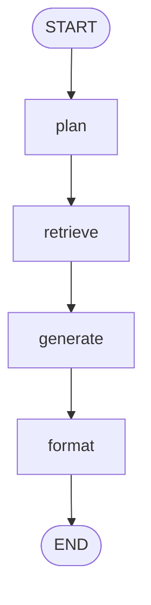
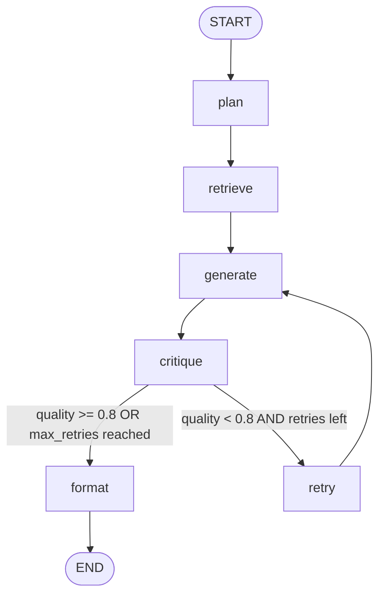
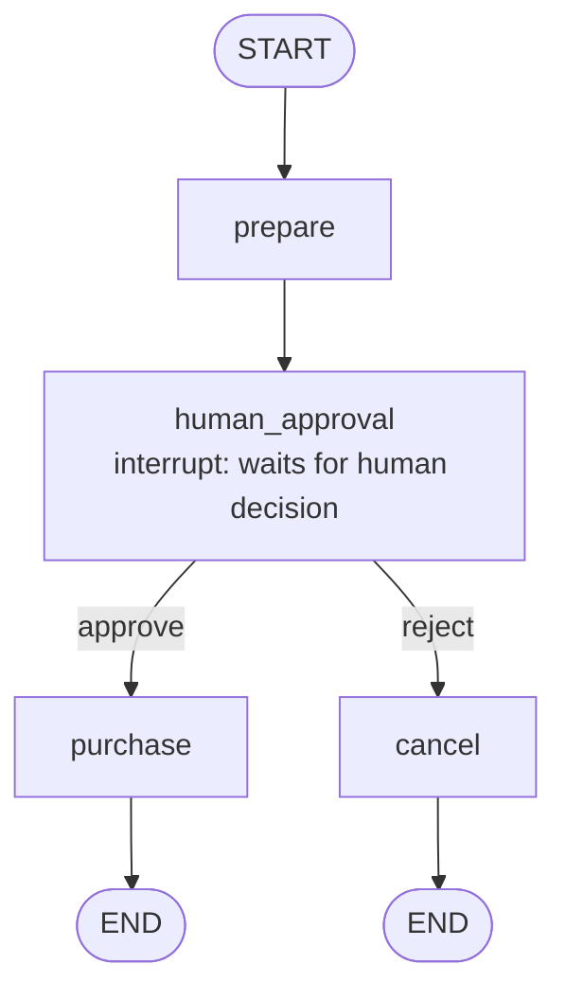

# Week 5 Day 3 — LangGraph: Stateful, Multi-Step & Cyclical Agent Workflows

Real agent workflows aren't a single loop — they branch, loop back, and need explicit control over state. This submission moves from Day 2's LangChain `AgentExecutor` to **LangGraph**, which models agents as graphs of nodes (steps) and edges (transitions), giving far more control over branching, cycles, human approval, and persistence.

## Contents

| Task | Description | Status |
|---|---|---|
| [Task 1](#task-1--graph-concepts--state-design) | Graph Concepts & State Design | ✅ |
| [Task 2](#task-2--build-a-linear-graph) | Build a Linear Graph | ✅ |
| [Task 3](#task-3--add-conditional-edges--cycles) | Add Conditional Edges & Cycles | ✅ |
| [Task 4](#task-4--human-in-the-loop--interrupts) | Human-in-the-Loop & Interrupts | ✅ |
| [Task 5](#task-5--persistence--debugging) | Persistence & Debugging | ✅ |

---

## Task 1 — Graph Concepts & State Design

Explains LangGraph's core building blocks — `StateGraph`, nodes, edges, conditional edges, and the shared `State` object — before any code is written.

- **State schema:** `ResearchState` (`TypedDict`) for a research-assistant workflow: search → draft → critique → revise.
- **Diagram:** ASCII flowchart drawn before implementation, showing the branch (`quality >= 0.8` → END, else → REVISE) and the revise → critique cycle.
- **Build:** placeholder nodes wired with `add_node`, `add_edge`, and `add_conditional_edges`, then compiled with `.compile()`.

## Task 2 — Build a Linear Graph

A 4-node linear pipeline: **plan → retrieve → generate → format**.

- `retrieve` calls the real Day 2 CSV-backed `lookup_product` tool (`@tool`-decorated, reads from `products.csv` via pandas) — not a re-implemented dict lookup.
- Compiled and run on a sample input (`"Laptop"`).
- State printed after every node via `.stream()`, plus a full final-state dump via `.invoke()`.



## Task 3 — Add Conditional Edges & Cycles

Extends the Task 2 graph with a **critique → retry** self-correction loop.

- `critique` scores the generated answer and is deliberately tuned so the retry loop fires at least once, proving the cycle actually executes (not just wired but dormant).
- `max_retries` guard in state prevents infinite looping — the router forces `finish` once the cap is hit.
- Every pass is logged (`[CRITIQUE]`, `[RETRY]`, `[ROUTER]`).
- Short explanation of why this loop-back pattern is natural in LangGraph (explicit graph, state fields, conditional edges routing to any node) but awkward in a plain `AgentExecutor` (single linear loop, no notion of named steps or "go back to X").



**Verified execution trace:**
```
[CRITIQUE] Pass 1 — quality_score: 0.5
[RETRY] Looping back to generate — attempt 1 of 2
[CRITIQUE] Pass 2 — quality_score: 0.9
```

## Task 4 — Human-in-the-Loop & Interrupts

A purchase-approval workflow that pauses for human sign-off before a risky action.

- `interrupt()` pauses execution inside `request_human_approval`, before the graph can reach `purchase`.
- `MemorySaver` checkpoints the paused state so it can be resumed later.
- Demonstrated on two independent threads (`thread_id`) — one resumed with `Command(resume="approve")`, the other with `Command(resume="reject")` — confirming both paths and thread isolation.
- Discussion: human-in-the-loop is worth the latency for costly, hard-to-reverse, or external-system actions (real purchases, emails to real customers); full autonomy is fine for cheap, reversible, low-stakes actions (calculator calls, read-only lookups). Gate only the specific risky node, not the whole workflow.



**Verified:** `get_state(config).next == ('human_approval',)` while paused, confirming execution genuinely halts rather than silently completing.

## Task 5 — Persistence & Debugging

Rebuilds the Task 4 graph with a dedicated checkpointer to demonstrate replay/debugging on top of persistence.

- `MemorySaver` + `thread_id` persist and resume a paused conversation, same as Task 4.
- `get_state_history()` returns the full checkpoint sequence for a thread — `__start__` → `prepare` → `human_approval` (paused) → `purchase` (approved) → completed — genuine step-by-step time-travel, not just the current state.
- A historical checkpoint is located (the one where `approval_status == "pending"`) and re-fetched via its own `.config`, proving the frozen-in-time state can be replayed independently of the current state.
- Comparison table: when to reach for `AgentExecutor` vs. LangGraph in a real project.

| Aspect | AgentExecutor | LangGraph |
|---|---|---|
| Core model | model → tool → observation → answer | explicit graph of nodes and edges |
| Branching | not supported cleanly | conditional edges, native support |
| Cycles / retries | manual outer while-loop | native, edges loop back to earlier nodes |
| State | implicit, in-memory only | explicit, typed `State` object |
| Human-in-the-loop | not built in | native, via `interrupt()` + checkpointer |
| Persistence | not built in | native, via checkpointer (e.g. `MemorySaver`) |
| Debugging / replay | limited | `get_state_history()` gives full trace |
| Best for | simple tool-using chatbots | research, approvals, financial actions, multi-step agents |

**Practical rule:** simple agent loop → `AgentExecutor`. Complex stateful workflow → LangGraph.

---

## Requirements

```
langgraph
langchain-core
pandas
```

Install with:

```bash
pip install -U langgraph langchain-core pandas
```

## Notebook Structure

All tasks live in a single notebook, in order: install → Task 1 → Task 2 → Task 3 → Task 4 → Task 5. Each task's graph is self-contained (separate `StateGraph` builder, separate state schema) so any task can be re-run independently without depending on later cells.
