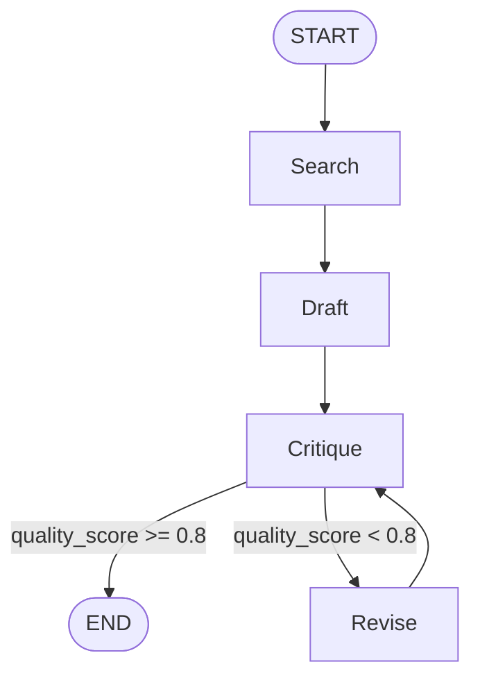
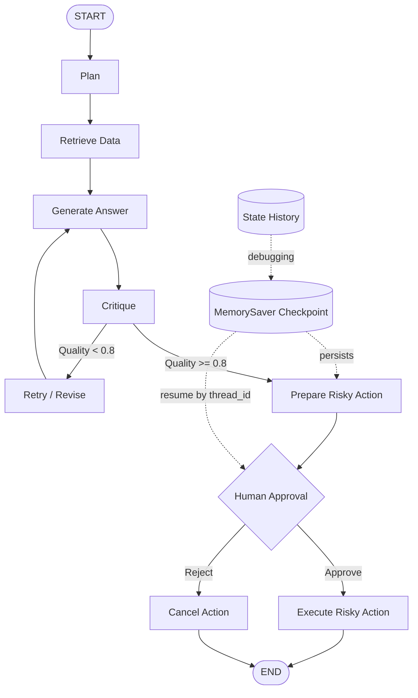

```mermaid
flowchart TD
    START([START]) --> SEARCH[Search]
    SEARCH --> DRAFT[Draft]
    DRAFT --> CRITIQUE[Critique]

    CRITIQUE -->|quality_score >= 0.8| END([END])
    CRITIQUE -->|quality_score < 0.8| REVISE[Revise]

    REVISE --> CRITIQUE
```

```mermaid
flowchart TD
    START([START]) --> PLAN[Plan]
    PLAN --> RETRIEVE[Retrieve Data]
    RETRIEVE --> GENERATE[Generate Answer]
    GENERATE --> CRITIQUE[Critique]

    CRITIQUE -->|Quality >= 0.8| PREPARE[Prepare Risky Action]
    CRITIQUE -->|Quality < 0.8| RETRY[Retry / Revise]

    RETRY --> GENERATE

    PREPARE --> APPROVAL{Human Approval}
    APPROVAL -->|Approve| ACTION[Execute Risky Action]
    APPROVAL -->|Reject| CANCEL[Cancel Action]

    ACTION --> END([END])
    CANCEL --> END

    CHECKPOINT[(MemorySaver Checkpoint)] -. persists .-> PREPARE
    CHECKPOINT -. resume by thread_id .-> APPROVAL

    HISTORY[(State History)] -. debugging .-> CHECKPOINT
```